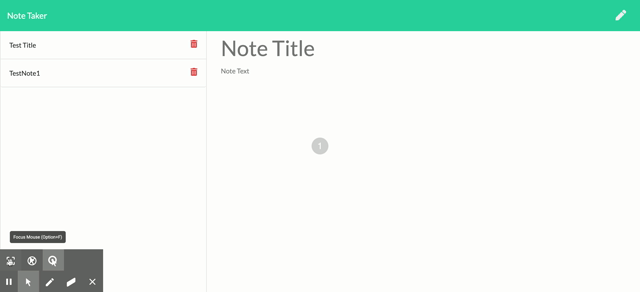

# notetaker application

## Description
This application is built for users that need to keep track of a lot of information, it's easy to forget or be unable to recall something important. Being able to take persistent notes allows users to have written information available when needed. This application that can be used to write, save, and delete notes. This application is using an express backend and saves and retrieve note data from a JSON file.

 
## Live Site
[Live Site](https://stark-shore-20922.herokuapp.com/)

## Installation
If you want to use this you need to Run the NPM install

## Glimpse of the app

## Credits
I found some examples of projects online very helpfull to complete this project

## License

[License](./LICENSE.txt)
MIT &copy; 2020 Anees Azeez
